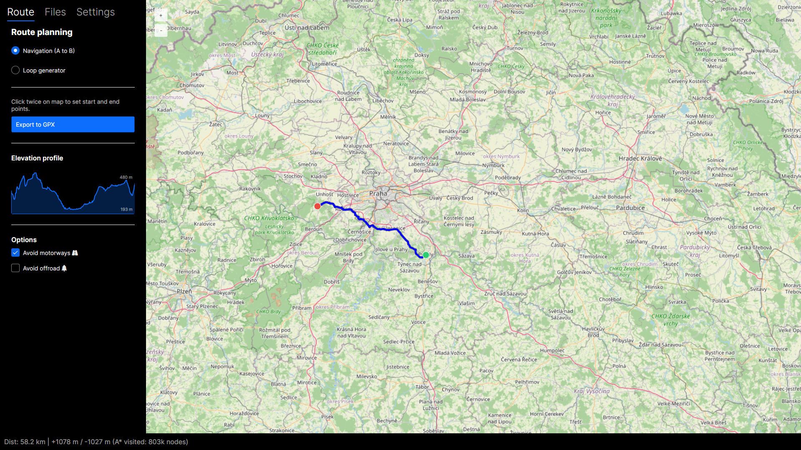

# Domestiq

[](LICENSE)
[](https://github.com/Filakcz/Domestiq/releases)
[](https://dotnet.microsoft.com/)
[](https://avaloniaui.net/)

**Domestiq** is your personal route planner. It uses OpenStreetMap data and SRTM elevation profiles to calculate the most efficient routes.




## Getting Started

### 1. Download the Application
From [GitHub Releases](https://github.com/Filakcz/Domestiq/releases) download the latest version for your operating system (Windows or Linux).

For Linux you may need to use `chmod +x DomestiqAvalonia` and then ./DomestiqAvalonia 

### 2. Load map data
Choose one of two options (first is better):
- **Pre-processed maps**: Download pre-processed `.bin` files (available for Prague, Czechia, and Středočeský kraj in GitHub Releases) and load them.
- **Raw OSM data + elevation data**: 
Import [elevation data](https://viewfinderpanoramas.org) folder with multiple files in format `N49E015.hgt`.
Download a `.osm.pbf` file from [Geofabrik](https://download.geofabrik.de/) 


### Building from Source
```
git clone https://github.com/Filakcz/Domestiq.git
cd Domestiq/DomestiqAvalonia
dotnet run
```

### Creating Avalonia binaries
**Windows:**
```
dotnet publish -c Release -r win-x64 --self-contained true -p:PublishSingleFile=true
```

**Linux:**
```
dotnet publish -c Release -r linux-x64 --self-contained true -p:PublishSingleFile=true
```

## License
This project is licensed under the [Apache License 2.0](LICENSE).
